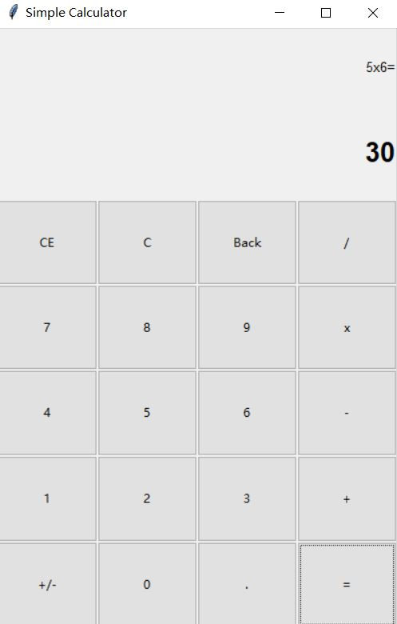
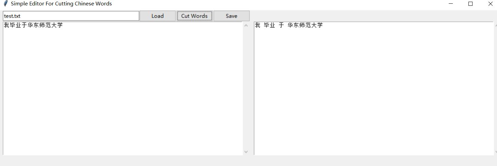
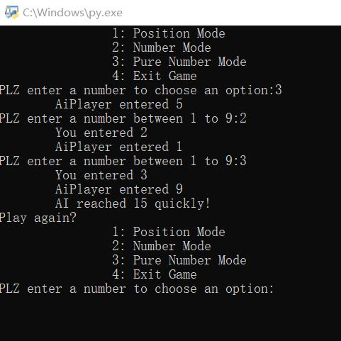

# I_LOVE_PYTHON
# for python learning
### There are some branches except the master branch.
### The branch "[python_grammar](https://github.com/Titiana/I_LOVE_PYTHON/tree/python_grammar)" and "[python_program](https://github.com/Titiana/I_LOVE_PYTHON/tree/python_program)" contains files that I have learned in Professor Yang's class and I have modified according my ideas.
### The branch "[python_library](https://github.com/Titiana/I_LOVE_PYTHON/tree/python_library)" is about the exercise for learning python library
### Here is the display of my programs

